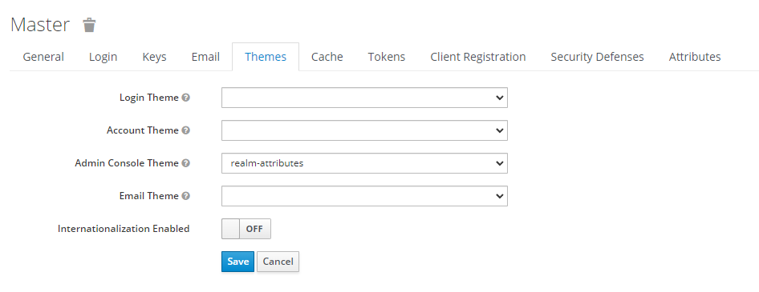
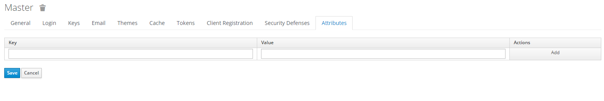

# Keycloak theme - Realm attributes interface

## Overview

This is a simple keycloak theme to manage realm attributes via the admin console. It extends the __old admin console__
theme.

It adds a tabs in realm page. You just have to select *realms-attributes* as __Admin Console Theme__ and hit `F5`:


This new page look like this: 

## Usage

You can use keycloak with these command or just use the extension *(jar
file)* [see documentation here](https://www.keycloak.org/docs/latest/server_development/#deploying-themes).

```
Usage:
  make <task>

Project task
  build            Build docker image from source
  run              Start the container
  logs             Display logs from the running container
  stop             Stop the container
  rm               Destroy the container

Internal services starting tasks
  dev              Start 'keycloak' service in dev mode (themes are not cached so that you can easily work on them without a need to restart)
  kc               (Re)start 'keycloak' service only (also available: 'kc-[build|logs|sh|stop|rm])
  db               (Re)start 'postgres' service only (also available: 'db-[build|logs|sh|stop|rm])

Commons basics tasks
  bash             Open a new bash session
  help             Display this help
```
